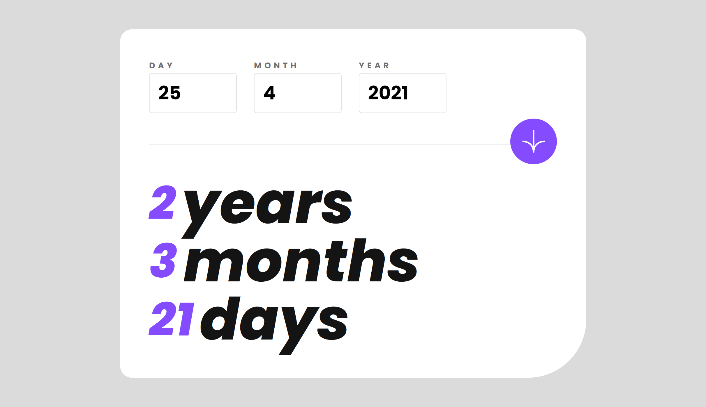
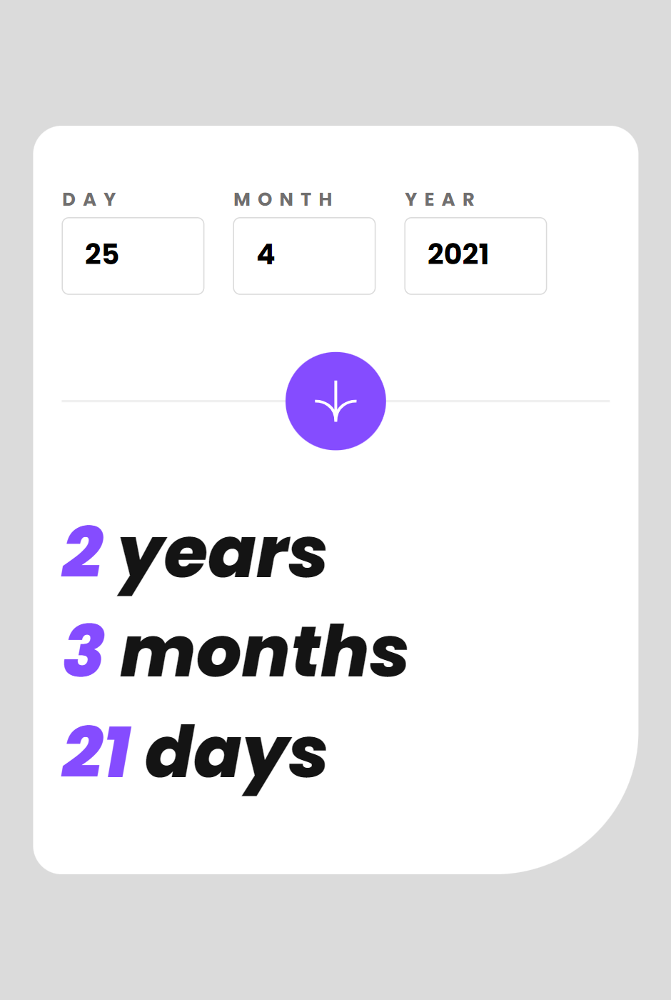

# Frontend Mentor - Solución de aplicación de calculadora de edad

Esta es una solución al [desafío de la aplicación de calculadora de edad en Frontend Mentor] (https://www.frontendmentor.io/challenges/age-calculator-app-dF9DFFpj-Q). Los desafíos de Frontend Mentor lo ayudan a mejorar sus habilidades de codificación mediante la creación de proyectos realistas.

## Tabla de contenido

- [Frontend Mentor - Solución de aplicación de calculadora de edad](#frontend-mentor---solución-de-aplicación-de-calculadora-de-edad)
  - [Tabla de contenido](#tabla-de-contenido)
  - [Descripción general](#descripción-general)
    - [El reto](#el-reto)
    - [Captura de pantalla](#captura-de-pantalla)
      - [Diseño Escritorio](#diseño-escritorio)
      - [Diseño movil](#diseño-movil)
    - [Enlaces](#enlaces)
  - [Mi proceso](#mi-proceso)
    - [Construido con](#construido-con)
  - [Autor](#autor)

## Descripción general

### El reto

Los usuarios deben ser capaces de:

- Ver una edad en años, meses y días después de enviar una fecha válida a través del formulario
- Recibir errores de validación si:
   - Cualquier campo está vacío cuando se envía el formulario
   - El número de día no está entre 1-31
   - El número del mes no está entre 1-12
   - El año está en el futuro.
   - La fecha no es válida, p. 31/04/1991 (hay 30 días en abril)
- Ver el diseño óptimo para la interfaz según el tamaño de pantalla de su dispositivo
- Vea los estados de desplazamiento y enfoque para todos los elementos interactivos en la página
- **Bonificación**: vea los números de edad animados a su número final cuando se envía el formulario

### Captura de pantalla

#### Diseño Escritorio

#### Diseño movil

### Enlaces

- URL de la solución: [GitHub](https://github.com/jean266/calculara-de-fecha.git)
- URL del sitio en vivo: [Vercel](https://calculara-de-fecha-4s02abrri-jean266.vercel.app/)

## Mi proceso

### Construido con

- Marcado HTML5 semántico
- Propiedades personalizadas de CSS
- SASS
- GULP
- Caja flexible
- Flujo de trabajo móvil primero
- [moment.js](https://momentjs.com/) - Biblioteca JS 

## Autor

- Mentor de frontend - [@jean266](https://www.frontendmentor.io/profile/jean266)